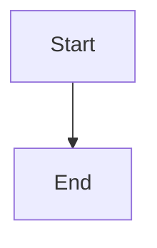

# prats.page

My personal website and scratchpad — built with [Eleventy (11ty)](https://www.11ty.dev/), esbuild, and a bit of mischief.

## Tech Stack

| What | How |
|---|---|
| **Static site generator** | [Eleventy v3](https://www.11ty.dev/) |
| **Templates** | Nunjucks (`.njk`), Markdown (`.md`) |
| **Asset bundling** | [esbuild](https://esbuild.github.io/) via `esbuild.config.js` |
| **Formatting / linting** | [Biome](https://biomejs.dev/) (format on save, `biome.json`) |
| **JS runtime** | [Bun](https://bun.sh/) |
| **Syntax highlighting** | `@11ty/eleventy-plugin-syntaxhighlight` |
| **RSS** | `@11ty/eleventy-plugin-rss` |
| **Table of contents** | `eleventy-plugin-toc` |
| **Reading time** | `eleventy-plugin-reading-time` |

## Getting Started

```bash
# Install dependencies
bun install

# Development (starts Eleventy dev server + asset watcher)
bun run dev

# Production build (clean → build assets → build site)
bun run build

# Format code
bun run format
```

`bun run dev` runs two parallel processes:
- `dev:assets` — esbuild in watch mode (CSS + JS)
- `dev:site` — Eleventy with `--serve` (auto-reload)

The site is served at `http://localhost:8080` by default.

## Project Structure

```
├── src/                        # Source directory
│   ├── data/
│   │   └── site.json           # Site config (author, links, metadata)
│   ├── css/                    # Stylesheets (esbuild entry point)
│   ├── js/                     # JavaScript (esbuild entry point)
│   ├── images/                 # Static images (pass-through copy)
│   ├── includes/               # Nunjucks partials
│   ├── layouts/                # Nunjucks layout templates
│   ├── posts/                  # Blog posts (Markdown)
│   ├── experiments/            # Experiment pages (Markdown)
│   ├── index.md                # Home page
│   ├── about.md                # About page
│   ├── 404.njk                 # 404 page
│   ├── archive.njk             # Archive page
│   ├── experiments.njk         # Experiments listing
│   ├── feed.njk                # RSS feed template
│   ├── robots.njk              # robots.txt
│   ├── sitemap.njk             # sitemap.xml
│   └── tags.njk                # Tags listing
├── public/                     # Build output (gitignored)
├── .eleventy.js                # Eleventy configuration
├── esbuild.config.js           # esbuild configuration
├── biome.json                  # Biome configuration
└── package.json                # Dependencies & scripts
```

## Scripts

| Script | Description |
|---|---|
| `bun run dev` | Start development server with live reload |
| `bun run build` | Production build (clean → assets → site) |
| `bun run start` | Eleventy serve only (no asset rebuild) |
| `bun run clean` | Remove `public/` directory |
| `bun run format` | Format all files with Biome |

## Writing Content

### Blog Posts

Add a Markdown file to `src/posts/` with frontmatter:

```yaml
---
title: "Your Post Title"
date: 2025-01-01
tags: ["tag1", "tag2"]
---
```

### Experiments

Add a Markdown file to `src/experiments/`.

### Mermaid Diagrams

Wrap mermaid code blocks with the `mermaid` language tag:

````markdown

````

## Deployment

The `public/` directory is the build output. Deploy it to any static host (Netlify, Vercel, Cloudflare Pages, etc.).

The site is configured for the custom domain **prats.page** (see `src/data/site.json`).

## License

MIT — see `package.json`.
